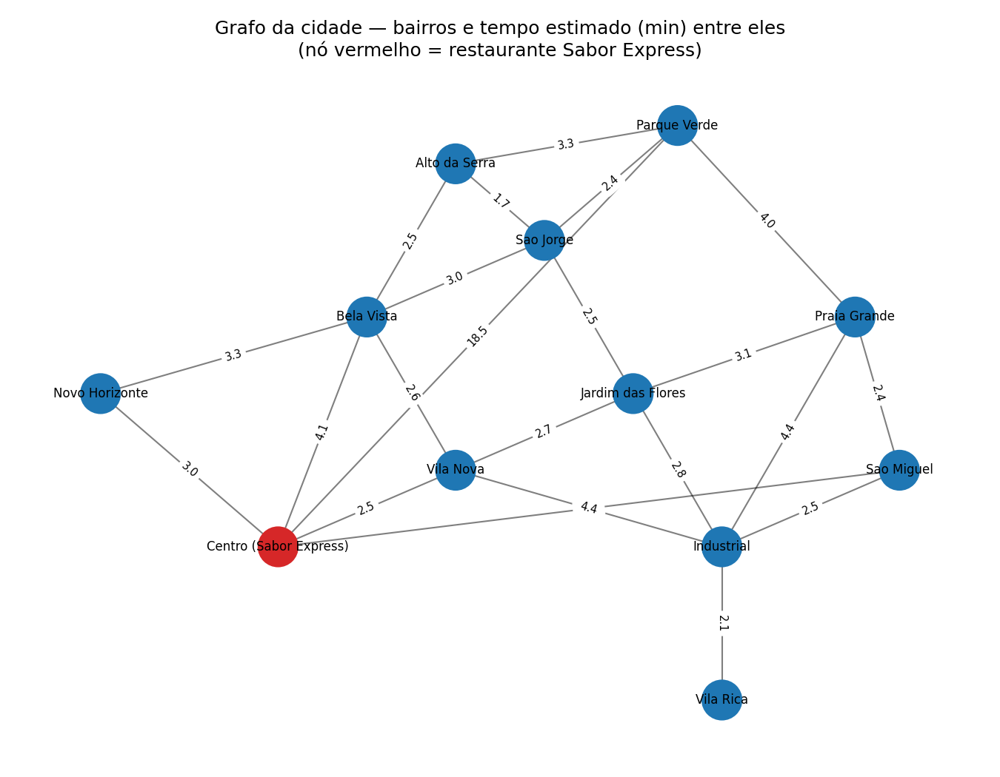
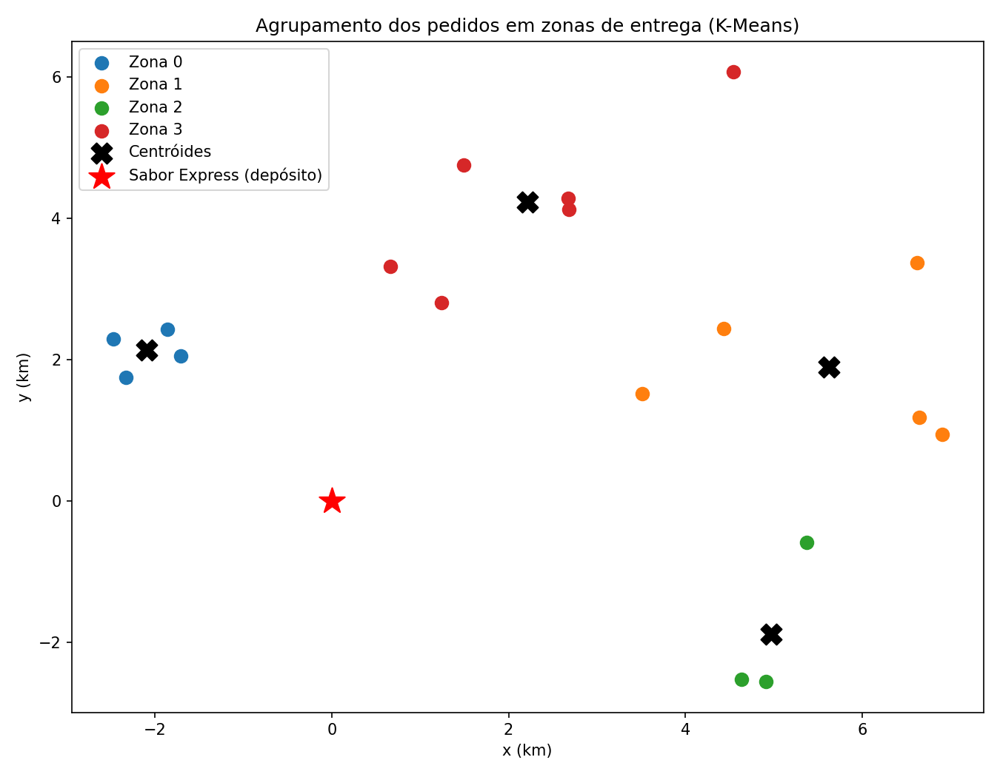
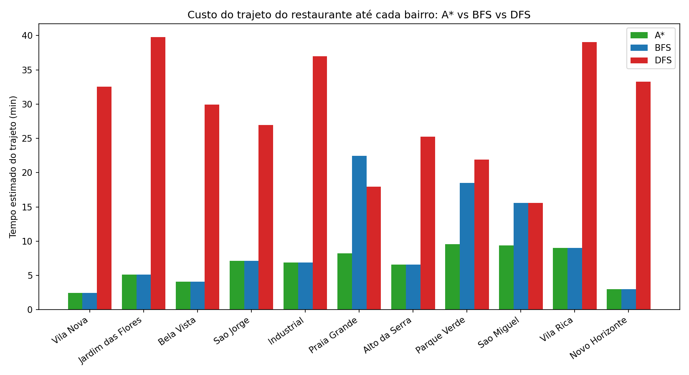

# Rota Inteligente: Otimização de Entregas com Algoritmos de IA

**Disciplina:** Artificial Intelligence Fundamentals
**Empresa fictícia do desafio:** Sabor Express (delivery de alimentos)

Este repositório contém a solução desenvolvida para o desafio "Rota Inteligente", que propõe o uso de algoritmos clássicos de Inteligência Artificial para otimizar as rotas de entrega de uma empresa de delivery durante horários de pico.

---

## 1. Descrição do Problema, Desafio Proposto e Objetivos

A Sabor Express é uma pequena empresa de delivery de alimentos que atua na região central de uma cidade. Durante os horários de pico (almoço e jantar), a empresa enfrenta atrasos recorrentes: os entregadores definem os percursos apenas com base na experiência pessoal, sem qualquer apoio tecnológico, o que resulta em rotas ineficientes, maior consumo de combustível e clientes insatisfeitos.

O desafio consiste em desenvolver uma solução baseada em Inteligência Artificial capaz de:

1. Representar a cidade como um **grafo**, em que os nós são bairros/pontos de entrega e as arestas são ruas, com pesos baseados no tempo estimado de deslocamento;
2. 2. Encontrar, de forma eficiente, o **menor caminho** entre o restaurante e cada ponto de entrega, considerando as restrições urbanas (ruas, distâncias e congestionamento);
   3. 3. Em cenários com muitos pedidos simultâneos, **agrupar entregas próximas em zonas**, para que cada entregador atenda uma região coesa em vez de se deslocar de forma dispersa pela cidade.
     
      4. **Objetivos do projeto:**
     
      5. - Modelar a malha viária da região central como um grafo ponderado;
         - - Implementar e comparar algoritmos de busca de caminho (A*, BFS e DFS) para o problema de roteamento;
           - - Implementar um algoritmo de aprendizado não supervisionado (K-Means) para agrupar pedidos em zonas de entrega;
             - - Avaliar os resultados com métricas objetivas (tempo estimado de trajeto, nós visitados na busca, silhouette score do agrupamento);
               - - Documentar as decisões de projeto, limitações e propostas de melhoria.
                
                 - ---

                 ## 2. Abordagem Adotada

                 A solução foi dividida em duas frentes complementares, que juntas resolvem o problema descrito no desafio:

                 **a) Roteamento ponto a ponto (busca em grafo).**
                 A cidade foi modelada como um grafo não direcionado em que cada bairro é um nó com coordenadas (x, y) e cada rua é uma aresta com dois atributos: distância (km) e tempo estimado (min). O tempo de cada rua foi calculado como `distância × fator de congestionamento`, com fatores diferentes por via — simulando o cenário descrito no desafio, em que vias aparentemente mais diretas (as que um entregador escolheria "no olho") podem estar mais congestionadas no horário de pico do que uma rota alternativa um pouco mais longa em distância, porém mais rápida em tempo real.

                 Sobre esse grafo, foi implementado o algoritmo **A\*** para encontrar o caminho de menor custo (tempo) entre o restaurante (depósito) e cada ponto de entrega, usando como heurística a distância em linha reta convertida em tempo mínimo possível (a uma velocidade máxima de referência de 60 km/h). Essa heurística é **admissível** — nunca superestima o custo real — o que garante que o A* encontre sempre o caminho ótimo.

                 Para efeito de comparação, os mesmos trajetos também foram calculados com **BFS** (busca em largura, que minimiza o número de arestas/paradas, ignorando o peso) e **DFS** (busca em profundidade, que apenas encontra *um* caminho válido, sem garantia de otimalidade). Essa comparação evidencia por que um algoritmo informado como o A* é mais adequado ao problema real da empresa do que uma busca cega.

                 **b) Agrupamento de pedidos em zonas (clustering).**
                 Para o cenário de alta demanda (muitos pedidos simultâneos), os pontos de entrega foram tratados como um problema de aprendizado não supervisionado: cada pedido é um ponto (x, y) no mapa, e o algoritmo **K-Means** agrupa esses pontos em zonas geográficas coesas. Cada zona pode então ser atribuída a um único entregador, que atende todos os pedidos daquela região em uma única saída, em vez de rotas isoladas e dispersas.

                 O número de zonas (k) não foi fixado arbitrariamente: foi escolhido testando valores de k entre 2 e 5 (faixa compatível com o tamanho de frota de entregadores de uma empresa pequena) e selecionando o k com melhor **silhouette score**, métrica que mede o quão bem separados e coesos estão os agrupamentos.

                 ---

                 ## 3. Algoritmos Utilizados

                 | Algoritmo | Papel na solução | Arquivo |
                 |---|---|---|
                 | **A\*** | Encontra o caminho de menor tempo entre o restaurante e cada ponto de entrega, usando heurística de distância euclidiana | `src/grafo.py` |
                 | **BFS** (busca em largura) | Baseline de comparação: caminho com menos "saltos" entre bairros, ignorando o tempo das ruas | `src/grafo.py` |
                 | **DFS** (busca em profundidade) | Baseline de comparação: primeiro caminho válido encontrado, sem otimização | `src/grafo.py` |
                 | **K-Means** | Agrupa pedidos simultâneos em zonas de entrega, para dividir o trabalho entre entregadores | `src/clustering.py` |
                 | **Silhouette score** | Métrica usada para escolher automaticamente o número de zonas (k) do K-Means | `src/clustering.py` |

                 O pipeline completo (carregamento dos dados, execução dos algoritmos, geração dos gráficos e do resumo de resultados) está em `src/main.py`.

                 ---

                 ## 4. Diagrama do Grafo/Modelo Usado na Solução

                 O grafo abaixo foi gerado por código (`src/main.py`, a partir de `data/bairros.csv` e `data/ruas.csv`) e representa os bairros da região atendida pela Sabor Express. O nó vermelho é o restaurante (depósito); os números sobre as arestas são o tempo estimado, em minutos, para percorrer aquela rua:

                 

                 O agrupamento dos pedidos em zonas de entrega (K-Means), usado no cenário de alta demanda, é ilustrado a seguir — cada cor representa uma zona, o "X" preto é o centróide de cada zona e a estrela vermelha é o restaurante:

                 

                 ---

                 ## 5. Análise dos Resultados

                 ### 5.1 Roteamento: A* vs BFS vs DFS

                 O restaurante foi conectado a bairros mais distantes por duas avenidas diretas (Centro → Parque Verde e Centro → São Miguel) com forte fator de congestionamento — representando exatamente o tipo de via que um entregador escolheria "pela experiência", por parecer mais direta, mas que na prática pode ser mais lenta no horário de pico. Essa condição foi incluída de propósito para evidenciar a diferença entre busca cega e busca informada.

                 | Destino | A* (min) | BFS (min) | DFS (min) |
                 |---|---|---|---|
                 | Vila Nova | 2,46 | 2,46 | 32,53 |
                 | Jardim das Flores | 5,14 | 5,14 | 39,76 |
                 | Bela Vista | 4,11 | 4,11 | 29,96 |
                 | São Jorge | 7,13 | 7,13 | 26,94 |
                 | Industrial | 6,89 | 6,89 | 36,96 |
                 | Praia Grande | **8,24** | 22,48 | 17,93 |
                 | Alto da Serra | 6,57 | 6,57 | 25,24 |
                 | Parque Verde | **9,57** | 18,48 | 21,93 |
                 | São Miguel | **9,35** | 15,56 | 15,56 |
                 | Vila Rica | 8,99 | 8,99 | 39,06 |
                 | Novo Horizonte | 2,97 | 2,97 | 33,28 |
                 | **Média** | **6,49** | **9,16** | **29,01** |

                 

                 **Leitura dos resultados:**

                 - Nos destinos em que só existe uma rota "óbvia" e sem congestionamento relevante, A* e BFS coincidem — o que é esperado, já que BFS também acha um caminho válido quando não há alternativas mais rápidas.
                 - - Nos três destinos servidos pela avenida direta congestionada (Praia Grande, Parque Verde e São Miguel), o BFS — por escolher o caminho com **menos paradas**, e não o mais rápido — cai na avenida congestionada e perde entre **11% e 65%** a mais de tempo do que a rota realmente ótima. Em média, A* entrega uma rota **29,1% mais rápida que o BFS** nesses casos.
                   - - O DFS, por não ter nenhuma noção de custo, encontrou caminhos em média **77,6% mais lentos que o A\***, chegando a rotas de mais de 30 minutos para trajetos que o A* resolve em menos de 5.
                     - - Em termos de **eficiência de busca** (nós explorados até achar o destino), o A* visitou em média **2,64 nós** por consulta, contra **10,45** do BFS — ou seja, além de achar a rota mais rápida, o A* faz isso examinando muito menos alternativas, graças à heurística.
                      
                       - ### 5.2 Agrupamento (K-Means)
                      
                       - Testando k de 2 a 5 zonas sobre os 18 pedidos simulados, o silhouette score obtido foi:
                      
                       - | k (nº de zonas) | Silhouette score |
                       - |---|---|
                       - | 2 | 0,462 |
                       - | 3 | 0,506 |
                       - | **4** | **0,521** |
                       - | 5 | 0,495 |
                      
                       - O melhor resultado (k = 4) indica que, para o volume de pedidos simulado, dividir a cidade em **4 zonas de entrega** produz grupos mais coesos e mais bem separados entre si do que 2, 3 ou 5 zonas — ou seja, 4 entregadores trabalhando por zona é a divisão mais equilibrada nesse cenário.
                      
                       - ### 5.3 Eficiência da Solução
                      
                       - - O A* é comprovadamente mais eficiente que as buscas cegas tanto em **qualidade da solução** (rota mais rápida) quanto em **custo computacional** (menos nós visitados), o que o torna adequado para uso em tempo real, inclusive à medida que a cidade (grafo) cresce.
                         - - O K-Means com seleção automática de k evita a necessidade de definir manualmente o número de zonas a cada novo lote de pedidos, adaptando-se ao volume e à dispersão geográfica dos pedidos do momento.
                          
                           - ### 5.4 Limitações Encontradas
                          
                           - - O grafo utilizado é uma **simplificação da malha viária real** (12 bairros, 22 ruas), construído para fins didáticos. Uma cidade real teria milhares de segmentos de rua, mão única, cruzamentos e semáforos.
                             - - Os tempos de deslocamento são **estáticos** (fatores de congestionamento fixos), enquanto o trânsito real varia dinamicamente ao longo do dia — o próprio desafio cita o sistema ORION da UPS como referência de uso de dados de tráfego em tempo real, o que não foi implementado aqui.
                               - - O K-Means assume zonas de formato aproximadamente esférico/convexo e é sensível a *outliers* — um pedido muito isolado pode distorcer o centróide de uma zona inteira (visível no cluster que inclui o pedido no bairro Parque Verde, mais distante dos demais).
                                 - - A solução não considera a **janela de tempo** de cada pedido (tempo máximo até a entrega), nem a **capacidade** de cada entregador (número máximo de pedidos por rota), o que seria necessário em um sistema de produção.
                                   - - Não foi implementado roteamento **multi-destino dentro de uma mesma zona** (o problema do caixeiro-viajante entre os pedidos de uma zona) — hoje o projeto resolve o caminho até cada ponto individualmente e o agrupamento em zonas, mas não a ordem ótima de visita dentro da zona.
                                    
                                     - ### 5.5 Sugestões de Melhoria
                                    
                                     - - Substituir os dados sintéticos por uma malha viária real (ex.: OpenStreetMap via biblioteca `osmnx`) e tempos de trânsito de uma API de mapas em tempo real;
                                       - - Adicionar um algoritmo de roteirização dentro de cada zona (ex.: heurística do caixeiro-viajante ou 2-opt) para definir a ordem de visita dos pedidos de um mesmo entregador;
                                         - - Evoluir o agrupamento para um modelo que já considere restrições operacionais (capacidade do entregador, prazo de entrega), por exemplo via clustering com restrições ou programação linear inteira mista (MILP), como sugerido no material de pesquisa (*Optimizing Logistics: Clustering e MILP*);
                                           - - Incorporar aprendizado por reforço para roteamento dinâmico, ajustando as rotas em tempo real conforme novos pedidos chegam durante o horário de pico, como discutido no artigo do ResearchGate indicado nas fontes de pesquisa do desafio;
                                             - - Adicionar testes automatizados e um pequeno painel (dashboard) para visualizar as rotas do dia.
                                              
                                               - ---

                                               ## Estrutura do Repositório

                                               ```
                                               .
                                               ├── README.md
                                               ├── data/
                                               │   ├── bairros.csv        # nós do grafo: bairros e coordenadas
                                               │   ├── ruas.csv           # arestas do grafo: distância e tempo entre bairros
                                               │   └── pedidos.csv        # pontos de entrega simulados (usados no K-Means)
                                               ├── docs/
                                               │   ├── grafo_cidade.png           # diagrama do grafo da cidade
                                               │   ├── clusters_entregas.png      # diagrama do agrupamento K-Means
                                               │   ├── comparacao_algoritmos.png  # gráfico comparativo A* vs BFS vs DFS
                                               │   └── resultados.txt             # resumo numérico de todos os resultados (JSON)
                                               ├── src/
                                               │   ├── gerar_dados.py     # gera ruas.csv e pedidos.csv a partir de bairros.csv
                                               │   ├── grafo.py           # implementação do grafo, A*, BFS e DFS
                                               │   ├── clustering.py      # implementação do K-Means e escolha automática de k
                                               │   └── main.py            # pipeline completo: roda tudo e gera os gráficos/resultados
                                               ├── requirements.txt       # dependências Python do projeto
                                               └── .gitignore
                                               ```

                                               ## Como Executar

                                               Pré-requisitos: Python 3.10+.

                                               ```bash
                                               # 1. clonar o repositório
                                               git clone <URL-DO-SEU-REPOSITORIO>
                                               cd sabor-express

                                               # 2. instalar as dependências
                                               pip install -r requirements.txt

                                               # 3. (opcional) regenerar os dados de ruas e pedidos a partir dos bairros
                                               python src/gerar_dados.py

                                               # 4. rodar o pipeline completo: A*, BFS, DFS, K-Means e geração dos gráficos
                                               python src/main.py
                                               ```

                                               Os gráficos serão salvos em `docs/` e um resumo numérico dos resultados em `docs/resultados.txt`. Rodar o passo 4 novamente sempre reproduz exatamente os mesmos números (os dados usam seed fixa), então os resultados descritos na seção 5 podem ser conferidos a qualquer momento.

                                               ## Vídeo Pitch

                                               *(link do vídeo no YouTube a ser adicionado após a gravação)*
                                               
